# TEJL Repository Template

<!-- VERSION BADGE: Derives from VERSION file -->


> **Enterprise-grade repository template with AI-first governance and bureaucratic accountability.**

A comprehensive project template that enforces structured development through formal protocols, Work Orders, checkpoints, and multi-agent AI governance. Designed for both commercial and open-source projects.

---

## Key Features

- **AI-First Governance** - Binding rules for any AI assistant (Claude, GPT, Gemini, etc.)
- **Work Order System** - Mandatory audit trail for all changes
- **Multi-Agent Support** - Coordinate 1-150 AI agents with shared governance
- **Analysis Archive** - Durable investigations, audits, profiling reports, and strategic reviews
- **Single Source of Truth** - VERSION files, not scattered references
- **Public Policy Baseline** - Security, contributing, and code-of-conduct documents included
- **Checkpoint Protocol** - Milestone certification with documentation sync
- **Language Agnostic** - Supports Rust, Go, Python, Node.js, or polyglot

---

## Quick Start

### Use This Template

1. Click **"Use this template"** on GitHub
2. Clone your new repository
3. Run the setup wizard:

```bash
# Validate initial structure
just validate

# Or manually:
bash .template/scripts/validate.sh .
```

4. Customize `project-meta.yaml` with your project details
5. Update `PROJECT-INTERNAL/MANAGEMENT/PROJECT-ELABORATION.md` with your backlog

### For AI Agents

AI agents should start with:

```
Read AGENTS.md first, then follow the governance chain.
```

---

## Philosophy

### Single Responsibility

Everything has ONE job:
- **VERSION file** = Single source of version truth
- **Files** = One responsibility each
- **Functions** = One action each
- **Comments** = First-class citizens, always current

### Bureaucratic Accountability

Every change is tracked:
- **Work Orders** required for all completed work
- **Corrective Work Orders** for errors
- **Checkpoints** for milestones
- **No unauthorized work**

---

## Repository Structure

```
.
├── AGENTS.md                     # Canonical AI entry point and navigation map
├── CLAUDE.md                     # Compatibility pointer to AGENTS.md
├── VERSION                       # Single source of version truth
├── project-meta.yaml             # Project identity (never syncs)
├── SECURITY.md                   # Security reporting policy
├── CONTRIBUTING.md               # Contribution workflow
├── CODE_OF_CONDUCT.md            # Community standards
│
├── PROJECT-INTERNAL/             # Internal governance
│   ├── GOVERNANCE/               # The Constitution (immutable)
│   │   ├── AI-INSTRUCTIONS.md    # Core rules for all AI agents
│   │   ├── MULTI-AGENT-PROTOCOL.md
│   │   └── ...
│   ├── MANAGEMENT/               # Project planning
│   │   ├── PROJECT-ELABORATION.md  # The Backlog
│   │   ├── PROJECT-RULES.md      # Project-specific rules
│   │   └── ENVIRONMENT.md        # System environment
│   ├── ANALYSIS/                 # Investigations, audits, reviews
│   ├── ARCHITECTURE/             # ADRs
│   ├── GUIDES/                   # Style guides & philosophy
│   ├── KNOWLEDGE/                # Living documentation (AI-updatable)
│   ├── AI/                       # Function schemas
│   ├── WORK-ORDERS/              # Audit trail
│   └── CHECKPOINTS/              # Milestone certificates
│
├── docs/                         # Public documentation
│   └── .templates/               # Documentation templates
│
├── .template/                    # Template management
│   ├── agent-rules.yaml          # Machine-parseable rules
│   ├── sync-manifest.yaml        # Sync configuration
│   └── scripts/                  # Sync and validation
│
└── src/                          # Source code (structure varies)
```

---

## Governance Overview

### Document Hierarchy

1. **GOVERNANCE/** - The Constitution (AI cannot modify)
2. **ADRs** - Architectural precedents (immutable after approval)
3. **PROJECT-ELABORATION.md** - Authorized work (AI can mark complete)
4. **ANALYSIS/** - Durable evidence and investigation records
5. **KNOWLEDGE/** - Living docs (AI can update)

### Work Order System

| Type | Purpose | When Required |
|------|---------|---------------|
| **WO** | Standard Work Order | Task completion, file creation |
| **CWO** | Corrective Work Order | Error resolution |
| **DWO** | Diagnostic Work Order | Investigation (optional) |

### Multi-Agent Compliance

All AI agents (whether 1 or 150) are bound by the same rules:
- Read AGENTS.md and AI-INSTRUCTIONS.md
- Create Work Orders for all work
- Coordinate sequence numbers via registry.json
- Update shared KNOWLEDGE/ documents

---

## AI Development Workflow

This template uses the TEJL AI workflow: `AGENTS.md` routes the assistant, MDAAI governs formal work, Work Orders preserve traceability, ADRs preserve architecture decisions, and checkpoints preserve milestone memory.



Editable source: [docs/diagrams/ai-workflow.mmd](docs/diagrams/ai-workflow.mmd)

### Diagramming Standard

Project diagrams are maintained as editable Mermaid source plus rendered SVG assets:

- Edit Mermaid source files in `docs/diagrams/*.mmd`.
- Render embeddable SVG files into `docs/assets/*.svg`.
- Embed SVG assets in Markdown so GitHub READMEs stay crisp and readable.
- Keep the matching Mermaid source linked near each embedded diagram.

Regenerate SVG assets after editing Mermaid source:

```bash
just diagrams
```

The full diagram editing and rendering procedure is documented in [PROJECT-INTERNAL/KNOWLEDGE/DEVELOPER-GUIDE.md](PROJECT-INTERNAL/KNOWLEDGE/DEVELOPER-GUIDE.md).

---

## Sync System

### Downstream (Template → Project)

```bash
# Pull template updates into your project
TEMPLATE_REPO=https://github.com/org/repo-template.git \
  bash .template/scripts/sync-downstream.sh
```

### Upstream (Project → Template)

```bash
# Contribute learnings back to template
bash .template/scripts/sync-upstream.sh
```

### Validation

```bash
# Validate project structure
bash .template/scripts/validate.sh
# Or: just validate
```

---

## Configuration

### project-meta.yaml

```yaml
name: "your-project"
classification:
  language: "rust"      # rust | go | python | node | polyglot
  visibility: "oss"     # oss | commercial
operator:
  name: "Your Name"
  email: "you@example.com"
```

### Language-Specific Setup

Style guides are in `PROJECT-INTERNAL/GUIDES/`:
- `RUST-ENTERPRISE-CODE-DOCTRINE.md`
- `GO-ENTERPRISE-CODE-DOCTRINE.md`
- `PYTHON-ENTERPRISE-CODE-DOCTRINE.md`
- `NODE-ENTERPRISE-CODE-DOCTRINE.md`
- `HTML-CSS-ENTERPRISE-CODE-DOCTRINE.md`

---

## Documentation Templates

| Template | Use For |
|----------|---------|
| `docs/.templates/readme.md` | Standard README |
| `docs/.templates/readme-monorepo.md` | Monorepo README |
| `docs/.templates/readme-folder.md` | Folder README |
| `docs/.templates/user-guide-page.md` | User documentation |
| `docs/.templates/api-endpoint.md` | API documentation |
| `docs/.templates/tutorial.md` | Step-by-step tutorials |
| `docs/.templates/architecture-overview.md` | Architecture docs |

---

## For AI Developers

### Required Reading Order

1. `AGENTS.md` - Canonical AI entry point
2. `PROJECT-INTERNAL/GOVERNANCE/AI-INSTRUCTIONS.md` - The Constitution
3. `PROJECT-INTERNAL/GOVERNANCE/MULTI-AGENT-PROTOCOL.md` - If multi-agent
4. `PROJECT-INTERNAL/MANAGEMENT/PROJECT-ELABORATION.md` - Find work
5. `PROJECT-INTERNAL/GUIDES/CODE-PHILOSOPHY.md` - Development principles

### Key Rules

- **No git operations without explicit instruction**
- **Work Orders required for all changes**
- **Comments are first-class citizens**
- **Single responsibility everywhere**
- **VERSION file is the source of truth**

---

## License

MIT License - see [LICENSE](./LICENSE) for details.

---

<p align="center">
  <strong>FACTORY OF ELECTRONIC UNITS AND LOGIC – TEJL d.o.o.</strong><br>
  <em>Bureaucracy-First, AI-Assisted Development</em>
</p>
